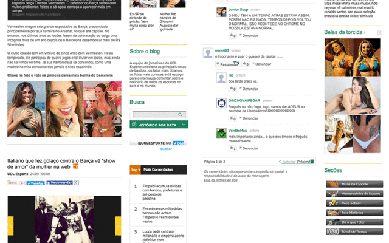

# UOL Esportes Sexista

A [Google Chrome](https://www.google.com/chrome) extension that redacts arguably sexist contents from [UOL](hrtp://uol.com.br) sports coverage.

 

> In the future I might port this to Firefox, Safari… and surely _pull request_ are welcomed!

## Example

## Contribute

Basically the extension is based on the file `build/app.js`, generated with `npm run build`.

To install the dependencies just run `npm install --only dev`.

The plugin is coded using [CoffeeScript](http://coffeescript.org) and tested with [mocha](http://mochajs.org/) via `npm t`.

## Credits

Icon
[Winner Podium](https://thenounproject.com/term/winner-podium/114603) by [TukTuk Design](https://thenounproject.com/tuktuk) from the [Noun Project](https://thenounproject.com/).

## License

Licensed under the [MIT LICENSE](https://github.com/cuducos/SemBelas/blob/master/LICENSE).